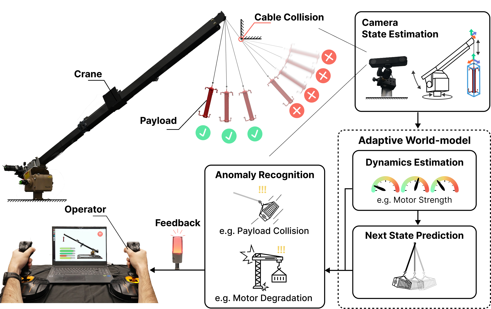
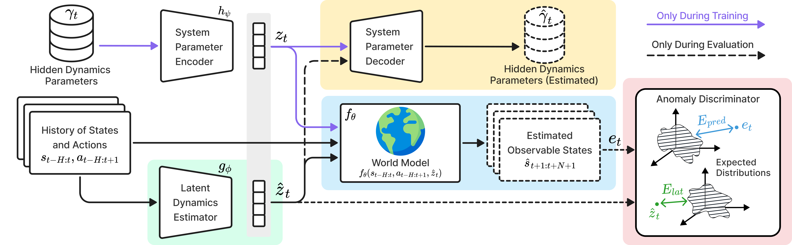
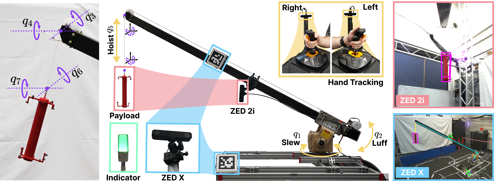

# Adaptive World-models for Anomaly REcognition (AWARE)

<p align="center">
  <a href="https://adaptive-intelligent-robotics.github.io/aware/"></a>
  <a href="https://adaptive-intelligent-robotics.github.io/aware/assets/AWARE_corl_camera_ready.mp4"></a>
  <a href="#citation"></a>
  <a href="#license"></a>
</p>

This repository presents the official implementation of [Adaptive World-Models for Anomaly Recognition (AWARE): A Framework for Robot Dynamics Prediction and Introspection](https://adaptive-intelligent-robotics.github.io/aware/).



In this work, we present AWARE, a framework to detect anomalies and provide introspection in robotic systems with only passive, CCTV-only cameras.



## Contents
- [Installation](#installation)
- [Usage](#usage)
  - [Evaluate](#evaluate)
  - [Generate data](#generate-data)
  - [Train](#train)
- [Repository structure](#repository-structure)
- [AWARE Dataset](#aware-dataset)
  - [Observations and Actions](#observations-and-actions)
  - [Anomalies](#anomalies)
- [Citation](#citation)
- [License](#license)

## Installation

We provide two AWARE models: **RSSM AWARE** (JAX) and **Transformer AWARE** (PyTorch). A CUDA GPU is required.

### Docker (recommended)

JAX and PyTorch wheels bundle CUDA, so the host only needs an NVIDIA driver and the [NVIDIA container toolkit](https://docs.nvidia.com/datacenter/cloud-native/container-toolkit/latest/install-guide.html).

```bash
docker build -t aware .
mkdir -p outputs checkpoints
docker run --gpus all -it -u $(id -u):$(id -g) \
  -v $PWD/data:/app/data -v $PWD/outputs:/app/outputs -v $PWD/checkpoints:/app/checkpoints \
  aware
```

All commands below are run from the repository root, inside the container. Running as your own user (`-u`) means generated data and outputs are owned by you, and is required when the repository is on an NFS mount, where the container's root user cannot write.

### Local

Requires Python 3.10. Using [uv](https://docs.astral.sh/uv/), which installs the exact versions in `uv.lock`:

```bash
uv sync
source .venv/bin/activate
```

Or with pip: `pip install -e .`

## Usage

To download only the research code, run:

```bash
git clone --single-branch --branch main https://github.com/adaptive-intelligent-robotics/aware.git
```

Configuration uses [Hydra](https://hydra.cc). Each script has a config in [`configs/`](configs), and any value can be overridden from the command line, e.g. `seed=2`.

### Evaluate

Evaluate anomaly detection on the [released dataset](#aware-dataset), reporting average precision (AP), AUROC and F1 score for the latent, predictor and combined (double) anomaly signals:

```bash
python scripts/evaluate.py checkpoint=checkpoints/rssm_aware_seed1
python scripts/evaluate.py checkpoint=checkpoints/transformer_aware_seed1
```

`checkpoint` is a run folder created by `scripts/train.py`. Use `id=<step>` to select a saved checkpoint, otherwise the most recent is loaded. Results are printed and saved to `outputs/evaluation/`.

Trained checkpoints for both models are available from the [releases page](../../releases). Download and extract them into `checkpoints/`.

### Generate data

Both models are trained in simulation, on trajectories from a domain randomised MuJoCo MJX model of the crane, driven by a randomised operator:

```bash
python scripts/generate_data.py num_episodes=10
```

This saves one file per episode into `data/sim/<date>/<time>`, along with the configs and dataset statistics. Each episode contains 4096 parallel environments of 2000 steps (~3.2GB). The paper dataset used 448 episodes (~1.3TB). Use `env.num_envs` to generate smaller files.

### Train

```bash
python scripts/train.py model=rssm_aware dataset_path=data/sim/<date>/<time>
python scripts/train.py model=transformer_aware dataset_path=data/sim/<date>/<time>
```

Runs are saved to `outputs/<date>/<time>`. The model and trainer configs, [`configs/model/`](configs/model) and [`configs/trainer/`](configs/trainer), are those used for the paper. Anomaly detection on the released dataset is evaluated periodically during training. To log to Weights & Biases, add `logging.log_to_wandb=true`.

## Repository structure

```
├── configs/              Hydra configs
│   ├── generate.yaml     ├── train.yaml     ├── evaluate.yaml
│   ├── env/              crane simulation
│   ├── model/            RSSM AWARE and Transformer AWARE
│   └── trainer/          one trainer per model
├── data/                 released dataset (and generated data in data/sim/)
├── scripts/              generate_data.py, train.py, evaluate.py
└── src/aware/
    ├── agents/           models, anomaly discriminators, operator and data loading
    ├── env/              MuJoCo MJX crane environment
    ├── evaluation/       anomaly detection evaluation
    ├── trainers/         training loops
    ├── utils/
    └── data_generation.py
```

## AWARE Dataset

To support fair comparisons and reproducibility, we release a dataset of 240 trajectories collected by five operators using our custom-built crane. The dataset is available with two levels of state-estimation noise:

- **Low noise**, using Vicon cameras: [`data/crane_human_operator_240traj_low_noise.pkl`](./data/crane_human_operator_240traj_low_noise.pkl).
- **High noise**, using CCTV cameras: [`data/crane_human_operator_240traj_high_noise.pkl`](./data/crane_human_operator_240traj_high_noise.pkl).

Both versions are stored as Python dictionaries with the same structure. Trajectory data are indexed by `(Batch, Time, Joint)`.

### Observations and Actions

Both versions contain two types of observations: `joint_angles` and `joint_velocities`.



The joint indices map to the following components:

| Joint Index | Name | Symbol |
|----------|----------|----------|
|  0  |  Slew  | q1 |
|  1  |  Luff  | q2 |
|  2  |  Boom tip pendulum | q3 |
|  3  |  Boom tip pendulum | q4 |
|  4  |  Hoist | q5 |
|  5  |  Payload tip pendulum | q6 |
|  6  |  Payload tip pendulum | q7 |

Actions represent target actuation velocities, stored in the `last_action` field. The actions actually executed are stored in `last_executed_action`.

In the high-noise version, `joint_angles` and `last_action` contain the states and actions estimated by the vision pipeline. We also provide synchronized ground-truth values in `joint_angles_gt` and `last_action_gt` to facilitate noise analysis.

### Anomalies

In both versions, the first 80 trajectories (indices `0–79`) are nominal, with no manipulation introduced at any point during the episode.

The remaining trajectories contain two types of anomalies:

- **Payload collisions:** 40 trajectories (indices `80–119`).
- **Motor degradation:** 120 trajectories (indices `120–239`).

For motor degradation, `data["action_scale_factors"]` records the scale factor applied to each motor during manipulation, with motor indices `0: slew`, `1: luff`, and `2: hoist`. The scale factors are 75%, 50%, 25%, and 0%. The first two fall within the domain randomization (DR) distribution; the latter two are out of distribution (OOD).

Each anomaly is introduced at a specific timestep. The boolean field `data["manipulation_bool"]` flags the time window during which manipulation is active.

## Citation
    @article{bold2026aware,
    author  = {Luke Beddow, George Mavroghenis, Rodrigo Alonso Chacon Quesada, Kamil Dreczkowski, Cong Sun, Jiankai Wang, Oscar Kwong-Fai Pang, Antoine Cully},
    title   = {Adaptive World Model for Anomaly Recognition},
    journal = {Conference on Robot Learning},
    year    = {2026}
    }

## License
The **content of this repository** is licensed under the [MIT License](https://opensource.org/license/mit/).
The **datasets** are licensed under the [CC BY-NC-SA 4.0 License](https://creativecommons.org/licenses/by-nc-sa/4.0/).

The network building blocks in [`src/aware/agents/embodied`](src/aware/agents/embodied) are adapted from [DreamerV3](https://github.com/danijar/dreamerv3), licensed under the MIT License.
